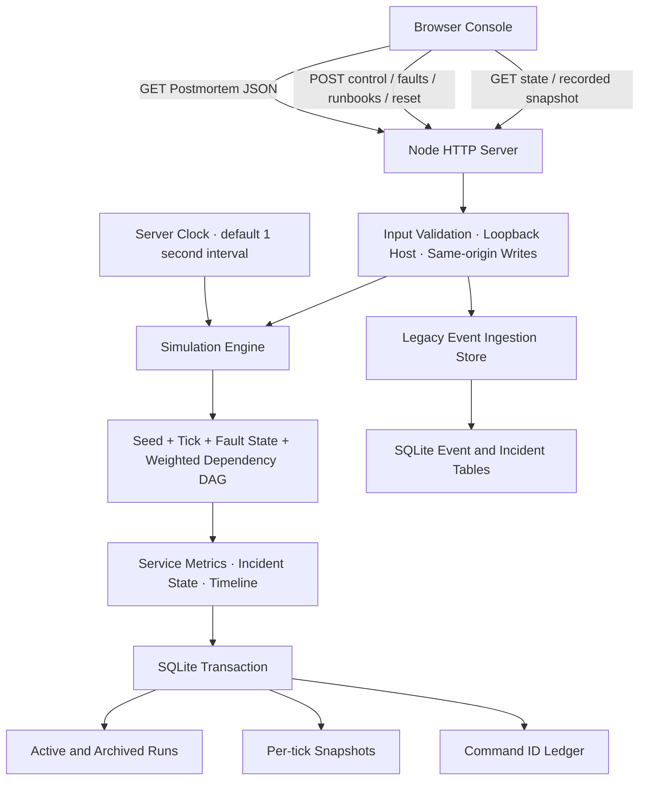

# Incident Replay Lab

8개 Service의 장애 전파를 관찰하고 Runbook의 복구 효과를 비교하는 **Backend/SRE 실습 앱**입니다. Node.js HTTP API, SQLite, 결정적 Simulation Engine과 Browser Console이 함께 동작합니다.

[Source](https://github.com/ijinz9191-tech/portfolio)

모든 Fault, Metric, Incident와 Probe는 **Synthetic Data**입니다. 실제 고객 Traffic, 회사 운영 지표, 외부 Infrastructure를 수집하거나 변경하지 않습니다. 실제 부하 발생기나 대규모 분산 시스템의 성능 검증 도구가 아닙니다.

## 실행

Node.js **24 이상**이 필요합니다. 외부 npm Dependency나 계정은 필요하지 않습니다. `node:sqlite`의 Experimental Warning은 현재 사용한 Node API에 따른 안내입니다.

```sh
node --version
npm test
npm run build
npm start
```

Browser에서 **http://127.0.0.1:4173**을 엽니다. 기본 DB는 `data/lab.sqlite`이며 재시작 후에도 기록이 유지됩니다. `Ctrl+C`로 서버를 종료합니다. `PORT`로 Port를, `LAB_DB`로 SQLite File 경로를 지정할 수 있습니다.

서버는 `127.0.0.1`에만 Bind합니다. `dist/`에는 Browser Asset만 있으므로 정적 Hosting만으로 API가 동작하지 않습니다. 외부 배포나 공개 다중 사용자 운영을 제공한다고 주장하지 않습니다.

## 3분 Guided Demo

1. **0:00 — 기준 상태 만들기.** Replay archive에서 Seed `42`로 **New run**을 누릅니다. 이전 Run은 보존 한도 안에서 Archive에 남습니다. 기본 상태는 `PAUSED`이며 8개 Service와 초기 Metric을 확인할 수 있습니다.
2. **0:30 — 장애 주입.** Fault injection에서 **Database Query Lock**, Intensity `2`를 선택하고 **Inject fault**를 누릅니다. `orders-db → orders-api → checkout-api → edge-gateway` 경로의 영향을 살펴봅니다. Topology의 화살표는 이와 반대로 호출자가 의존하는 대상을 가리킵니다.
3. **1:00 — 시간과 Signal 관찰.** STEP을 `5 ticks`로 선택하고 **+ Tick**을 누릅니다. Orders Database와 Edge Gateway를 선택해 Latency·Error Rate·Throughput 그래프를 비교합니다. 한 Tick은 Simulation 시간 5초입니다.
4. **1:30 — 원인에 맞는 조치.** Incident response에서 열린 Incident를 선택하고 **Release Query Lock**을 적용합니다. 상태가 `open → mitigating`으로 바뀌고 원인 Fault의 Pressure가 줄어듭니다. 다시 `5 ticks`를 진행하면 4 Tick의 Drain을 거쳐 `resolved`가 됩니다.
5. **2:00 — 결과와 과거 비교.** Incident의 Postmortem JSON을 Export합니다. Replay archive에서 이전 Tick을 선택하고 **Load snapshot**을 눌러 Topology·Metric·Incident를 읽기 전용으로 확인합니다. **Live로 돌아가기**로 복귀합니다.
6. **2:30 — 독립 장애 실험.** **Identity Token Expiry**와 **Database Query Lock**을 함께 주입해 봅니다. Query Lock만 복구하면 Identity 장애는 남습니다. **Run simulation**으로 Server Clock을 실행하고 **Pause**로 멈춥니다. 같은 Seed와 같은 Tick의 명령 순서로 다시 실행하면 같은 Metric을 비교할 수 있습니다.

UI는 Tab과 Keyboard로 Topology Service를 선택할 수 있습니다. 연결 실패 시 이전 상태라는 안내가 표시됩니다. Replay를 보는 동안 UI의 변경 동작은 비활성화됩니다.

## Architecture



- `src/server.mjs`: HTTP Routes, Public Asset Allowlist, Request 검증, Server Clock 수명 관리.
- `src/simulation.mjs`: 결정적 Metric 생성, 가중 Dependency DAG, Fault·Runbook·복구, Snapshot·Postmortem.
- `src/store.mjs`: SQLite 연결과 기존 Event Ingestion API. Simulation Table과 기존 Event Table은 같은 DB에 별도로 보존됩니다.
- `app.js`: Server State Rendering, SVG Topology·Charts, Incident 필터, Runbook·Replay UI.

## Model과 State

Service는 Edge Gateway, Checkout API, Catalog API, Orders API, Payment API, Identity API, Redis Cache, Orders Database입니다. 11개 Dependency Edge를 가진 고정된 비순환 그래프를 사용합니다.

| Scenario ID | Root Service | Runbook ID |
|---|---|---|
| `query-lock` | `orders-db` | `unlock-query` |
| `cache-eviction` | `redis-cache` | `warm-cache` |
| `identity-expiry` | `identity-api` | `rotate-identity` |
| `bad-release` | `checkout-api` | `rollback-release` |

Metric은 Seed·Tick으로 계산한 변동, Service의 Baseline, Root Fault의 Intensity·지속 시간, Dependency의 Pressure를 조합합니다. Intensity는 1–3이며 기본값은 2입니다. Client에서 임의 Metric을 만들지 않습니다. CPU·RPS·Latency는 이 모델의 출력이며 실제 측정값이나 예측 정확도 지표가 아닙니다.

Runbook은 연결된 Scenario의 열린 Incident에만 적용할 수 있습니다. 원인 Fault가 `active → mitigated → resolved`로, Incident가 `open → mitigating → resolved`로 전이합니다. 조치 직후 해당 Fault Pressure는 조치 직전의 35%로 낮아지고 4 Tick 동안 줄어듭니다. Baseline과 다른 원인의 영향도 포함하는 Service Metric 자체가 정확히 65% 감소한다는 뜻은 아닙니다. 다른 원인의 Fault는 그대로 남습니다.

Simulation 시간은 `2026-01-01T00:00:00.000Z`에서 시작하며 Tick마다 5초 진행합니다. 기본 Server Clock은 실제 시간 약 1초마다 한 Tick을 진행하고 Browser Tab과 독립적으로 동작합니다. 실행 중 수동 Tick은 거부합니다. 같은 Seed와 같은 Tick의 명령 순서가 같은 Metric과 History를 재현하지만 Run·Incident UUID까지 같지는 않습니다. 실제 시간의 사용자 입력 지연은 자동 실행 시 명령이 적용되는 Tick을 바꿀 수 있습니다.

## Persistence·Replay·Polling

- Command와 Timer Tick의 상태 변경은 SQLite Transaction 안에서 저장되며 실패 시 해당 변경을 Rollback합니다. WAL·Foreign Key·Busy Timeout을 사용합니다.
- Run, Incident, Metric History와 Command ID가 재시작 후에도 남습니다. 자동 실행 중 종료했더라도 복구한 Server는 **Paused** 상태로 시작합니다.
- Snapshot은 `(runId, tick)`별 마지막 저장 상태입니다. 같은 Tick 안에서 Fault·Runbook·Pause를 수행하면 그 Tick의 Snapshot이 갱신됩니다. 명령마다 별도 Version을 만드는 불변 Snapshot 모델은 아닙니다.
- Replay API는 저장 상태를 읽으며 Live State를 변경하지 않습니다. Replay 중에도 이미 실행 중인 Server Clock은 계속 진행할 수 있습니다.
- UI는 표시 중인 Tab에서 `/api/sim/state`를 약 1초마다 Polling합니다. 숨겨진 Tab과 Replay 화면에서는 자동 Polling을 멈춥니다. **SSE·WebSocket은 사용하지 않습니다.**
- UI는 실패한 변경 요청을 자동 재시도하지 않습니다. API Client는 선택적 `commandId`로 중복 실행을 방지할 수 있습니다. 같은 ID·같은 명령은 현재 State와 `duplicate: true`를 반환하고, 같은 ID의 다른 명령은 409입니다. 원래 응답을 그대로 재생하는 방식은 아닙니다.

## Simulation API

POST는 `Content-Type: application/json`과 16 KiB 이하 Body를 사용합니다. 아래 POST는 선택적으로 `commandId`를 받습니다.

| Method | Path | 입력 / 결과 |
|---|---|---|
| GET | `/api/health` | SQLite Readiness, 실제 Server Uptime, `synthetic: true` |
| GET | `/api/sim/state` | `schemaVersion: 2`; Clock, 8 Services·History, Topology, Scenarios, Runbooks, Faults, Incidents, Audit, Summary, Runs |
| POST | `/api/sim/control` | `{"action":"run"}` / `{"action":"pause"}` / `{"action":"tick","steps":5}`; Steps는 1–60, 기본 1 |
| POST | `/api/sim/reset` | `{"seed":42}`; Seed 0–2147483647, 새 Paused Run 생성과 기존 Run Archive |
| POST | `/api/sim/faults` | `{"scenarioId":"query-lock","intensity":2}` |
| POST | `/api/sim/runbooks` | `{"actionId":"unlock-query","incidentId":"<id>"}` |
| GET | `/api/sim/runs` | 보존된 Run·Seed·최신/최초 Tick 목록 |
| GET | `/api/sim/runs/:id?tick=5` | 저장된 Snapshot, `replay: true`; 범위 밖은 404 |
| GET | `/api/sim/incidents/:id/postmortem` | 원인·영향 경로·Timeline·Metric·Simulation 복구 시간·한계·SHA-256 |
| GET | `/api/sim/incidents/:id/export` | 같은 Report를 Attachment JSON으로 반환 |

Postmortem은 현재 또는 보존된 Run에서 생성합니다. `integrity.sha256`은 `integrity`를 제외한 Report의 `JSON.stringify()` 값에 대한 SHA-256입니다. 서명이나 외부 검증인의 인증이 아닙니다. Incident가 진행 중이면 Report의 내용과 Hash는 이후 변경될 수 있습니다. Metric과 Peak는 영향받은 Service의 관측값으로, 같은 Service의 동시 Fault 영향도 포함할 수 있습니다. 개별 Fault만의 기여량을 분리한 값은 아닙니다. 복구가 확정된 Incident의 Metric과 Timeline은 이후 다른 Fault로 다시 계산하지 않습니다.

기존 API도 유지합니다: `GET /api/scenarios`, `POST /api/scenarios {scenario}`, `GET /api/incidents`, `GET /api/incidents/:id`, `POST /api/incidents/:id/actions {action}`, `POST /api/events {events}`. 기존 Scenario는 `checkout-timeout`, `catalog-cache`, `identity-session`이며 Simulation의 4개 Fault와 별개입니다. Event Batch는 1–20개이고 전체가 원자적으로 저장됩니다. Event ID가 같은 정규화 Payload의 재전송은 중복으로 처리하고 다른 Payload는 409입니다. 과거 Timestamp의 늦은 Event는 거부하며 Event-time 재정렬을 구현하지 않습니다.

## 현재 한도와 검증

| 범위 | 보존·제약 |
|---|---|
| Service·Incident Metric History | 최근 120 Ticks |
| Replay Snapshot | Run마다 최근 360 Ticks |
| Run | 현재 Run을 포함해 최근 10개; 오래된 Run과 그 Snapshot은 삭제 |
| 전체 Audit Feed | 최근 300개 |
| Incident | Run마다 최대 100개; Incident별 Timeline은 별도 고정 길이 제한 없음 |
| Command ID Ledger | 현재 자동 보존 기한 없음 |
| 사용자·실행 구조 | Local 단일 사용자·단일 Server Process; 인증·다중 사용자 격리 없음 |

고정 DAG와 수식으로 인과 관계를 학습하는 모델입니다. 실제 Queue, Network Packet, Container, Database Lock, Token Server, Traffic Generator는 실행하지 않습니다. 자동 Clock에는 최대 실행 시간이나 최대 Tick에 의한 자동 종료가 없으므로 **Pause 또는 Server 종료**로 멈춥니다. 저장 용량 상한·장기 Data 보관·Production SLO·장애 예측 정확도는 제공하지 않습니다.

`npm test`는 Node 내장 Test Runner로 다음 동작을 검증합니다. 정확한 Test 개수와 결과는 현재 실행 출력이 기준입니다.

- 같은 Seed·명령 Schedule의 Metric 재현, Dependency 경로별 영향과 독립 장애 유지.
- Intensity·Runbook 효과, 4 Tick 복구, 잘못된 조치와 입력의 무변경 보장.
- 실제 HTTP Server의 요청·응답, SQLite 재연결, 중복 Command와 Event 처리.
- 읽기 전용 Replay, Run Archive·Snapshot 보존 한도, Postmortem Hash.
- JSON·Body·Origin·Host·Asset 검증과 Public Data 개인정보 유출 패턴 검사.

`npm run build`는 검증된 `index.html`, `styles.css`, `app.js`, `public.data.json`만 `dist/`에 복사합니다. 예상하지 않은 `dist` 파일이 있으면 Build가 멈춥니다. PDF·DB·Git File·지원자 정보는 Public Asset Allowlist와 Build에 포함하지 않습니다.

## 기여와 자료 경계

사용자는 실제 동작하는 Backend/SRE Portfolio라는 목표와 요구사항을 정의하고 결과를 검토·정정했습니다. Code·문서 구현과 검증은 AI 지원으로 진행했습니다. 사용자 단독 구현, 회사 실서비스 구축 성과나 실측 생산성 향상으로 제시하지 않습니다.

기존 개인 이력 자료는 이 앱의 Runtime Input이나 공개 API에 사용하지 않습니다. `README.md`와 `CAREEROPS.md`에는 이전 단계의 자료가 있을 수 있으며, **현재 앱 실행과 기능 범위는 이 APP.md가 기준**입니다.
